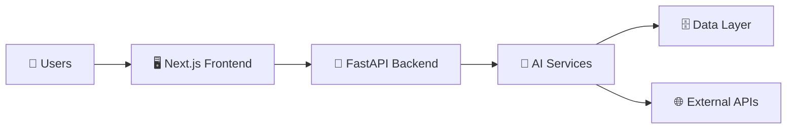
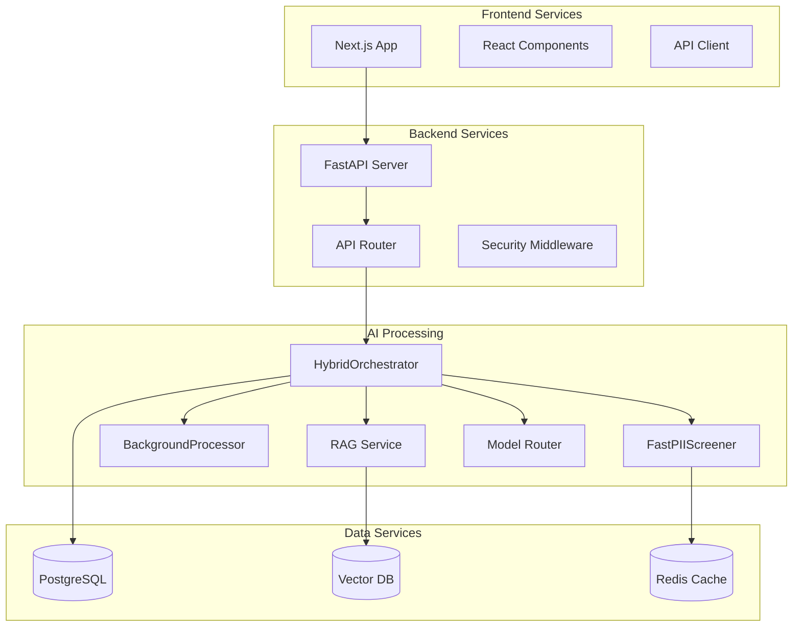
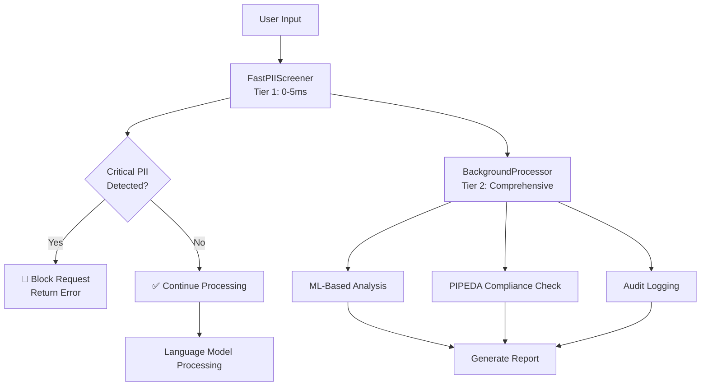
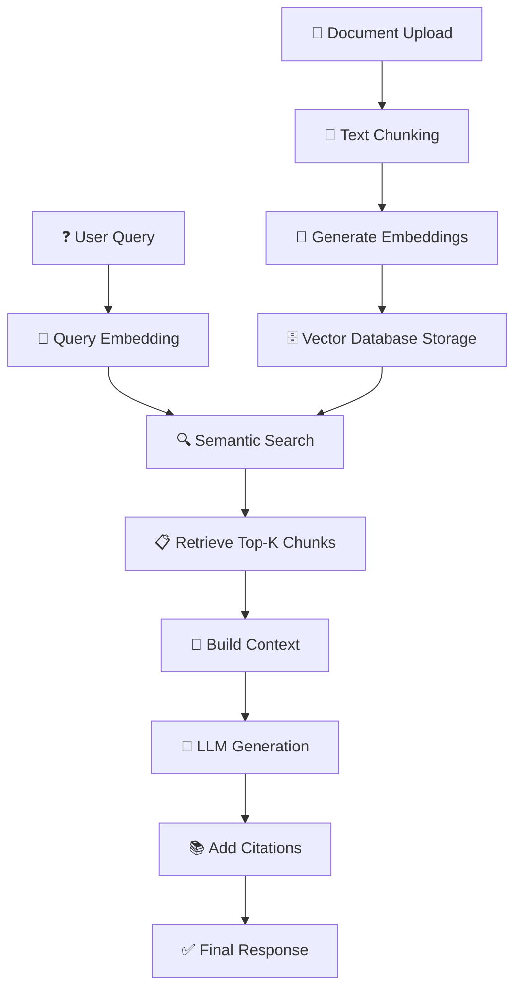
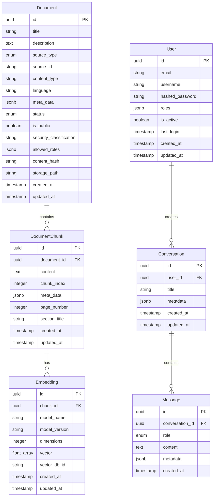
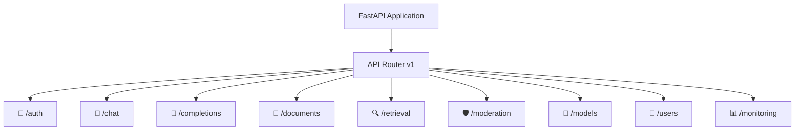
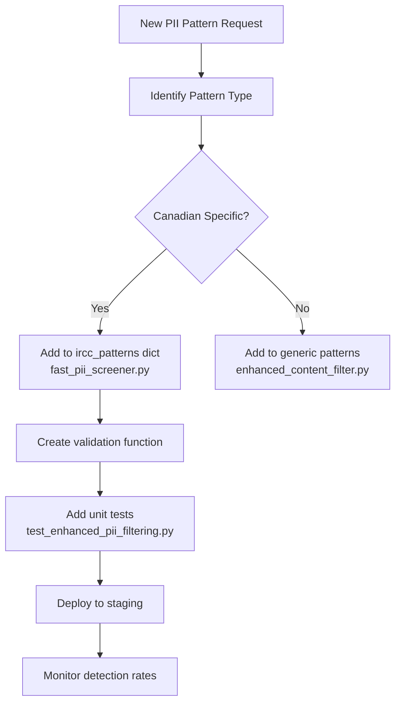
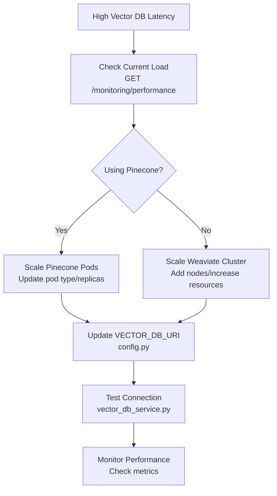

# 🚀 FastAPI + Next.js AI Platform - Architecture Documentation

## 📋 Table of Contents

- [System Overview](#-system-overview)
- [Architecture Layers](#-architecture-layers)
- [Core Services](#-core-services)
- [PII Detection](#-pii-detection)
- [RAG Pipeline](#-rag-pipeline)
- [Database Schema](#-database-schema)
- [API Endpoints](#-api-endpoints)
- [Maintenance Guides](#-maintenance-guides)
- [Developer Onboarding](#-developer-onboarding)
- [Quick Reference](#-quick-reference)

## 🎯 System Overview

Enterprise-grade AI platform featuring advanced PII detection, RAG capabilities, and PIPEDA compliance for Canadian organizations.

### Key Metrics
- **47** Total Services
- **12** API Endpoints  
- **6** Database Models
- **2** PII Detection Tiers

### Architecture Highlights
- **Two-Tier PII Detection**: 0-5ms fast screening + comprehensive background analysis
- **RAG Pipeline**: Vector databases with attribution and citations
- **PIPEDA Compliance**: Canadian privacy law compliance built-in
- **Enterprise Security**: JWT auth, RBAC, audit logging

## 🏗️ Architecture Layers

### Layer 1: Executive Overview

### Layer 2: Service Architecture

## ⚙️ Core Services

### 🔒 PII Services
- **FastPIIScreener** - Immediate blocking (0-5ms)
- **BackgroundProcessor** - Comprehensive analysis
- **EnterpriseContentFilter** - ML-based detection

### 🧠 RAG Services
- **VectorDBService** - Pinecone/Weaviate integration
- **EmbeddingService** - OpenAI embeddings
- **AttributionService** - Citation generation
- **DocumentProcessor** - Text chunking

### 🌐 LLM Services
- **OpenAIService** - GPT models
- **AnthropicService** - Claude models
- **OnPremService** - Local models
- **ModelRouter** - Request routing

### 🗄️ Data Services
- **SessionManager** - Database connections
- **Repositories** - Data access layer
- **Models** - SQLAlchemy entities
- **Schemas** - Pydantic validation

## 🔒 PII Detection

### Two-Tier Architecture

### Key Features

#### ⚡ Tier 1: FastPIIScreener
- **Pattern Matching**: SIN, UCI, IRCC numbers
- **Circuit Breaker**: Fail-safe protection
- **Redis Cache**: Performance optimization
- **Anonymization**: Real-time tokenization

#### 🔍 Tier 2: BackgroundProcessor
- **ML Models**: Advanced PII detection
- **PIPEDA Compliance**: Canadian privacy law
- **Audit Logging**: Complete trail
- **Queue Management**: Async processing

## 🧠 RAG Pipeline

### Complete Workflow

### Components

#### 📄 Document Processing
- **File Types**: PDF, DOCX, TXT, HTML
- **Chunking**: Semantic and fixed-size
- **Metadata**: Source tracking
- **Deduplication**: Content hashing

#### 🔢 Embedding Service
- **Models**: OpenAI text-embedding-ada-002
- **Batch Processing**: Efficient generation
- **Caching**: Avoid regeneration
- **Versioning**: Model updates

#### 🗄️ Vector Database
- **Pinecone**: Managed vector DB
- **Weaviate**: Open-source option
- **Hybrid Search**: Vector + keyword
- **Filtering**: Metadata-based

#### 📚 Attribution Service
- **Citations**: Automatic footnotes
- **Source Tracking**: Document lineage
- **Phrase Matching**: Exact attribution
- **Compliance**: Audit requirements

## 🗄️ Database Schema

### Entity Relationship Diagram

### Implementation Status

| Model | Status | Files |
|-------|--------|-------|
| Document | ✅ Implemented | `app/models/document.py` |
| DocumentChunk | ✅ Implemented | `app/models/document.py` |
| Embedding | ✅ Implemented | `app/models/embedding.py` |
| User | ❌ Missing | `app/models/user.py` |
| Conversation | ❌ Missing | `app/models/chat.py` |
| Message | ❌ Missing | `app/models/chat.py` |

## 🌐 API Endpoints

### Endpoint Structure

### Available Endpoints

#### 🔐 Authentication
- `POST /auth/login` - User authentication
- `POST /auth/refresh` - Token refresh
- `POST /auth/logout` - Session termination

#### 💬 Chat
- `POST /chat/completions` - Chat completion with PII filtering
- `GET /chat/history` - Conversation history

#### 🤖 Completions
- `POST /completions` - Text completion
- `POST /completions/stream` - Streaming completion

#### 📄 Documents
- `POST /documents/upload` - Document upload
- `GET /documents` - List documents
- `DELETE /documents/{id}` - Delete document

#### 🔍 Retrieval
- `POST /retrieval/search` - Semantic search
- `POST /retrieval/similarity` - Similarity search

#### 🛡️ Moderation
- `POST /moderation/screen` - Fast PII screening
- `POST /moderation/analyze` - Comprehensive analysis

#### 📊 Monitoring
- `GET /monitoring/pii/stats` - PII detection statistics
- `GET /monitoring/performance` - Performance metrics

## 🔧 Maintenance Guides

### Adding New PII Patterns

### Scaling Vector Database

## 🎓 Developer Onboarding

### Backend Developer Path (4 weeks)

#### Week 1: Foundation
- Read Architecture Docs
- Explore `app/main.py`
- Understand FastAPI Structure
- Set up Development Environment

**Key Files**: `app/main.py`, `app/core/config.py`, `app/api/v1/router.py`

#### Week 2: PII Deep Dive
- Study FastPIIScreener
- Understand BackgroundProcessor
- Review HybridOrchestrator
- Implement PII Pattern

**Key Files**: `app/services/pii/`, `app/services/hybrid_orchestrator.py`

#### Week 3: RAG Pipeline
- Explore VectorDBService
- Study EmbeddingService
- Review AttributionService
- Build RAG Feature

**Key Files**: `app/services/retrieval/`, `app/services/embeddings/`

#### Week 4: Integration
- Performance Optimization
- Testing Patterns
- First Major Contribution

**Key Files**: `tests/`, `docs/`, performance optimization

### Frontend Developer Path (4 weeks)

#### Week 1: Next.js Foundation
- Next.js App Structure
- React Components
- API Integration Patterns
- Authentication Flow

**Key Files**: Next.js `app/`, `components/layout/`, `lib/api/`

#### Week 2: Component Architecture
- Chat Components
- Document Components
- State Management
- UI/UX Patterns

**Key Files**: `components/chat/`, `components/documents/`, `context/`

#### Week 3: AI Integration
- Real-time Chat
- Document Upload
- Error Handling
- Performance Optimization

**Key Files**: `hooks/`, `lib/utils/`, error handling

#### Week 4: Advanced Features
- Testing Components
- Accessibility
- First Feature Implementation

**Key Files**: tests, accessibility, performance

## 📚 Quick Reference

### Key Configuration Files
- `app/core/config.py` - Main configuration
- `.env.example` - Environment variables
- `docker-compose.yml` - Container orchestration
- `requirements.txt` - Python dependencies

### Important Service Files
- `app/services/hybrid_orchestrator.py` - Main orchestration
- `app/services/pii/fast_pii_screener.py` - Fast PII detection
- `app/services/pii/background_processor.py` - Comprehensive PII analysis
- `app/services/retrieval/vector_db_service.py` - Vector database operations
- `app/services/embeddings/embedding_service.py` - Embedding generation

### Database Files
- `app/db/session.py` - Database session management
- `app/db/base.py` - Base model classes
- `app/models/document.py` - Document models
- `app/models/embedding.py` - Embedding models

### API Files
- `app/api/v1/router.py` - Main API router
- `app/api/v1/endpoints/` - Individual endpoint implementations

### Testing Files
- `tests/test_enhanced_pii_filtering.py` - PII detection tests
- `tests/test_pii_middleware_integration.py` - Integration tests

---

## 🔗 Interactive Documentation

For a fully interactive experience with clickable diagrams, expandable sections, and search functionality, open the `architecture-documentation.html` file in your browser.

## 📞 Support

For questions about the architecture or implementation details, refer to:
- Interactive HTML documentation
- Individual service documentation in `docs/`
- Code comments and docstrings
- Unit tests for usage examples

---

*This documentation is automatically generated and should be kept in sync with the codebase.*
